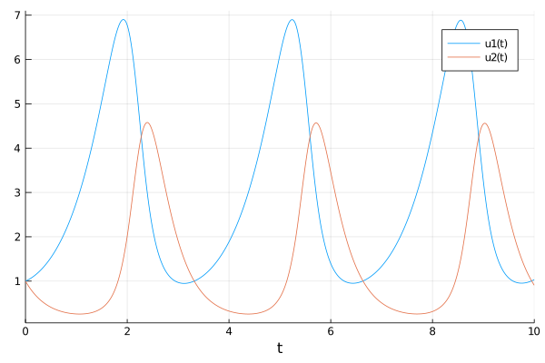
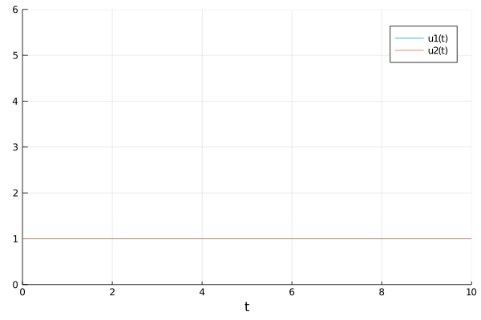
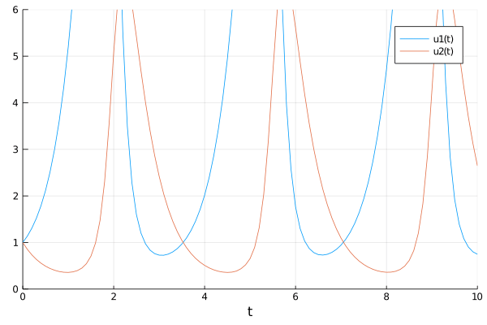
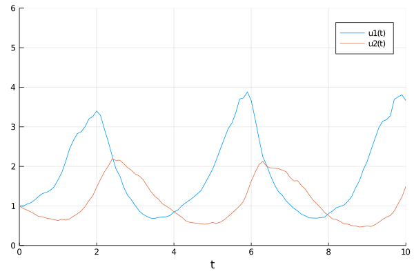
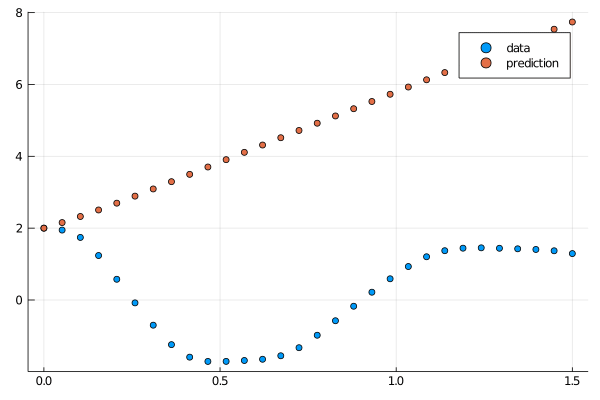
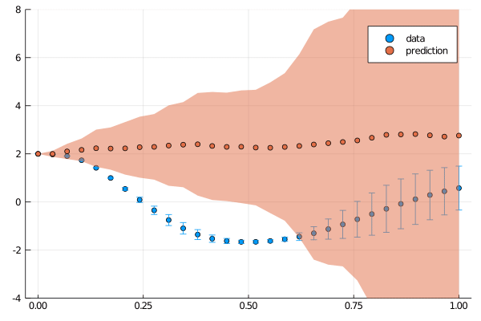
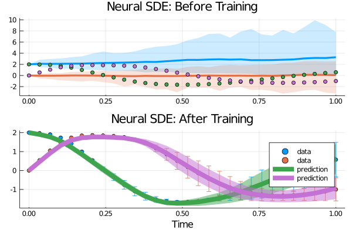

[](https://gitpod.io/#https://github.com/SciML/DiffEqFlux.jl)

# DiffEqFlux.jl

[](https://gitter.im/JuliaDiffEq/Lobby?utm_source=badge&utm_medium=badge&utm_campaign=pr-badge&utm_content=badge)
[](https://gitpod.io/#https://github.com/SciML/DiffEqFlux.jl)
[](https://travis-ci.org/SciML/DiffEqFlux.jl)
[](https://ci.appveyor.com/project/ChrisRackauckas/diffeqflux-jl)
[](https://gitlab.com/juliadiffeq/DiffEqFlux-jl/pipelines)

DiffEqFlux.jl fuses the world of differential equations with machine learning by
helping users put diffeq solvers into neural networks. This package utilizes
[DifferentialEquations.jl](http://docs.sciml.ai/dev/) and
[Flux.jl](https://fluxml.ai/) as its building blocks to support research in
[Scientific Machine
Learning](http://www.stochasticlifestyle.com/the-essential-tools-of-scientific-machine-learning-scientific-ml/)
and neural differential equations in traditional machine learning.

## Contents

* [Problem Domain](#problem-domain)

* [Citation](#citation)

* [Example Usage](#example-usage)
  - [Optimizing parameters of an ODE for an Optimal Control problem](#optimizing-parameters-of-an-ode-for-an-optimal-control-problem)
  - [Using Other Differential Equations](#using-other-differential-equations)
  - [Neural Ordinary Differential Equations](#neural-ordinary-differential-equations)
  - [Training a Neural Ordinary Differential Equation](#training-a-neural-ordinary-differential-equation)

* [Use with GPUs](#use-with-gpus)

* [Universal Differential Equations](#universal-differential-equations)
  - [Universal Differential Equations for Neural Optimal Control](#universal-differential-equations-for-neural-optimal-control)

* [Neural Differential Equations for Non-ODEs: Neural SDEs, Neural DDEs, etc.](#Neural-Differential-Equations-for-Non-ODEs:-Neural-SDEs,-Neural-DDEs,-etc.)

* [API Documentation](#api-documentation)
  - [Neural DE Layer Functions](#Neural-DE-Layer-Functions)

* [Benchmarks](#benchmarks)

## Problem Domain

DiffEqFlux.jl is not just for neural ordinary differential equations.
DiffEqFlux.jl is for universal differential equations. For an overview of the
topic with applications, consult the paper [Universal Differential Equations for
Scientific Machine Learning](https://arxiv.org/abs/2001.04385)

As such, it is the first package to support and demonstrate:

- Stiff universal ordinary differential equations (universal ODEs)
- Universal stochastic differential equations (universal SDEs)
- Universal delay differential equations (universal DDEs)
- Universal partial differential equations (universal PDEs)
- Universal jump stochastic differential equations (universal jump diffusions)
- Hybrid universal differential equations (universal DEs with event handling)

with high order, adaptive, implicit, GPU-accelerated, Newton-Krylov, etc.
methods. For examples, please refer to [the release blog
post](https://julialang.org/blog/2019/01/fluxdiffeq) (which we try to keep
updated for changes to the libraries). Additional demonstrations, like neural
PDEs and neural jump SDEs, can be found [at this blog
post](http://www.stochasticlifestyle.com/neural-jump-sdes-jump-diffusions-and-neural-pdes/)
(among many others!).

Do not limit yourself to the current neuralization. With this package, you can
explore various ways to integrate the two methodologies:

- Neural networks can be defined where the “activations” are nonlinear functions
  described by differential equations.
- Neural networks can be defined where some layers are ODE solves
- ODEs can be defined where some terms are neural networks
- Cost functions on ODEs can define neural networks

## Citation

If you use DiffEqFlux.jl or are influenced by its ideas for expanding beyond
neural ODEs, please cite:

```
@article{DBLP:journals/corr/abs-1902-02376,
  author    = {Christopher Rackauckas and
               Mike Innes and
               Yingbo Ma and
               Jesse Bettencourt and
               Lyndon White and
               Vaibhav Dixit},
  title     = {DiffEqFlux.jl - {A} Julia Library for Neural Differential Equations},
  journal   = {CoRR},
  volume    = {abs/1902.02376},
  year      = {2019},
  url       = {http://arxiv.org/abs/1902.02376},
  archivePrefix = {arXiv},
  eprint    = {1902.02376},
  timestamp = {Tue, 21 May 2019 18:03:36 +0200},
  biburl    = {https://dblp.org/rec/bib/journals/corr/abs-1902-02376},
  bibsource = {dblp computer science bibliography, https://dblp.org}
}
```

## Example Usage

For an overview of what this package is for,
[see this blog post](https://julialang.org/blog/2019/01/fluxdiffeq).

### Optimizing parameters of an ODE for an Optimal Control problem

First let's create a Lotka-Volterra ODE using DifferentialEquations.jl. For
more details, [see the DifferentialEquations.jl documentation](http://docs.juliadiffeq.org/dev/). The Lotka-Volterra equations have the form:

$$
\begin{align}
\frac{dx}{dt} &= \sigma \left( y - x \right)    \\
\frac{dy}{dt} &= x \left( \rho - z \right) - y  \\
\frac{dz}{dt} &= x y - \beta z                  \\
\end{align}
$$

```julia
using DifferentialEquations, Flux, Optim, DiffEqFlux, DiffEqSensitivity

function lotka_volterra!(du, u, p, t)
  x, y = u
  α, β, δ, γ = p
  du[1] = dx = α*x - β*x*y
  du[2] = dy = -δ*y + γ*x*y
end

# Initial condition
u0 = [1.0, 1.0]

# Simulation interval and intermediary points
tspan = (0.0, 10.0)
tsteps = 0.0:0.1:10.0

# LV equation parameter. p = [α, β, δ, γ]
p = [1.5, 1.0, 3.0, 1.0]

# Setup the ODE problem, then solve
prob_ode = ODEProblem(lotka_volterra!, u0, tspan, p)
sol_ode = solve(prob_ode, Tsit5())

# Plot the solution
using Plots
savefig(plot(sol_ode), "assets/LV_ode.png")
```



For this first example, we do not yet include a neural network. We take
[AD-compatible `concrete_solve`
function](https://docs.juliadiffeq.org/latest/analysis/sensitivity/) function
that takes the parameters and an initial condition and returns the solution of
the differential equation as a
[`DiffEqArray`](https://github.com/JuliaDiffEq/RecursiveArrayTools.jl) (same
array semantics as the standard differential equation solution object but
without the interpolations).

```julia
# Create a solution (prediction) for a given starting point u0 and set of
# parameters p
function predict_adjoint(p)
  return Array(concrete_solve(prob_ode, Tsit5(), u0, p, saveat = tsteps))
end
```

Next we choose a square loss function. Our goal will be to find parameter that
make the Lotka-Volterra solution constant `x(t)=1`, so we defined our loss as
the squared distance from 1. Note that when using `sciml_train`, the first
return is the loss value, and the other returns are sent to the callback for
monitoring convergence.

```julia
function loss_adjoint(p)
  prediction = predict_adjoint(p)
  loss = sum(abs2, x-1 for x in prediction)
  return loss, prediction
end
```

Lastly, we use the `sciml_train` function to train the parameters using BFGS to
arrive at parameters which optimize for our goal. `sciml_train` allows defining
a callback that will be called at each step of our training loop. It takes in
the current parameter vector and the returns of the last call to the loss
function. We will display the current loss and make a plot of the current
situation:

```julia
# Callback function to observe training
list_plots = []
iter = 0
callback = function (p, l, pred)
  global list_plots, iter

  if iter == 0
    list_plots = []
  end
  iter +=1

  display(l)

  # using `remake` to re-create our `prob` with current parameters `p`
  remade_solution = solve(remake(prob_ode, p = p), Tsit5(), saveat = tsteps)
  plt = plot(remade_solution, ylim = (0, 6))

  push!(list_plots, plt)
  display(plt)

  # Tell sciml_train to not halt the optimization. If return true, then
  # optimization stops.
  return false
end

# Display the ODE with the initial parameter values.
callback(p, loss_adjoint(p)...)

result_ode = DiffEqFlux.sciml_train(loss_adjoint, p,
                                    BFGS(initial_stepnorm = 0.0001),
                                    cb = callback)

animate(list_plots, "assets/LV_anim.gif")

```

```
* Status: failure (objective increased between iterations) (line search failed)

* Candidate solution
   Minimizer: [1.44e+00, 1.44e+00, 2.54e+00,  ...]
   Minimum:   1.993849e-06

* Found with
   Algorithm:     BFGS
   Initial Point: [1.50e+00, 1.00e+00, 3.00e+00,  ...]

* Convergence measures
   |x - x'|               = 1.27e-09 ≰ 0.0e+00
   |x - x'|/|x'|          = 4.98e-10 ≰ 0.0e+00
   |f(x) - f(x')|         = 1.99e-12 ≰ 0.0e+00
   |f(x) - f(x')|/|f(x')| = 1.00e-06 ≰ 0.0e+00
   |g(x)|                 = 5.74e-03 ≰ 1.0e-08

* Work counters
   Seconds run:   1  (vs limit Inf)
   Iterations:    6
   f(x) calls:    81
   ∇f(x) calls:   81
```

In just seconds we found parameters which give a loss of `1e-6`! We can get the
final loss with `result_ode.minimum`, and get the optimal parameters with
`result_ode.minimizer`. For example, we can plot the final outcome and show that
we solved the control problem and successfully found parameters to make the ODE
solution constant:

```julia
remade_solution = solve(remake(prob_ode, p = result_ode.minimizer), Tsit5(), saveat = tsteps)
savefig(plot(remade_solution, ylim = (0, 6)), "assets/LV_ode2.png")
```




This shows the evolution of the solutions:



### Using Other Differential Equations

Other differential equation problem types from DifferentialEquations.jl are
supported. For example, we can build a layer with a delay differential equation
like:

```julia
# Define the same LV equation, but including a delay parameter
function delay_lotka_volterra!(du, u, h, p, t)
  x, y = u
  α, β, δ, γ = p
  du[1] = dx = (α   - β*y) * h(p, t-0.1)[1]
  du[2] = dy = (δ*x - γ)   * y
end

# Initial parameters
p = [2.2, 1.0, 2.0, 0.4]

# Define a vector containing delays for each variable (although only the first
# one is used)
h(p, t) = ones(eltype(p), 2)

# Initial conditions
u0 = [1.0, 1.0]

# Define the problem as a delay differential equation
prob_dde = DDEProblem(delay_lotka_volterra!, u0, h, (0.0, 10.0), constant_lags = [0.1])

function predict_dde(p)
  return Array(concrete_solve(prob_dde, MethodOfSteps(Tsit5()),
                              u0, p, saveat = 0.1,
                              sensealg = TrackerAdjoint()))
end

loss_dde(p) = sum(abs2, x-1 for x in predict_dde(p))
loss_dde(p)
```

```
369.9247935840374
```

Notice that we chose `sensealg = TrackerAdjoint()` to utilize the Tracker.jl
reverse-mode to handle the delay differential equation.

Or we can use a stochastic differential equation. Here we demonstrate `sensealg
= ForwardDiffSensitivity()` (provided by DiffEqSensitivity.jl) for forward-mode
automatic differentiation of a small stochastic differential equation:

```julia
function lotka_volterra_noise!(du, u, p, t)
  du[1] = 0.1u[1]
  du[2] = 0.1u[2]
end

u0 = [1.0,1.0]
p = [2.2, 1.0, 2.0, 0.4]
prob_sde = SDEProblem(lotka_volterra!, lotka_volterra_noise!, u0, (0.0, 10.0))


function predict_sde(p)
  return Array(concrete_solve(prob_sde, SOSRI(), u0, p,
               sensealg = ForwardDiffSensitivity(), saveat = 0.1))
end

loss_sde(p) = sum(abs2, x-1 for x in predict_sde(p))
loss_sde(p)
```

```
4577.527984370252
```

For this training process, because the loss function is stochastic, we will use
the `ADAM` optimizer from Flux.jl. The `sciml_train` function is the same as
before. However, to speed up the training process, we will use a global counter
so that way we only plot the current results every 10 iterations. This looks
like:

```julia
list_plots = []
iter = 0
callback = function (p, l)
  global list_plots, iter

  # List plots is reset to an empty list on the first callback
  if iter == 0
    list_plots = []
  end

  display(l)
  iter += 1
  if iter%10 == 1
    remade_solution = solve(remake(prob_sde, p = p), SOSRI(), saveat = 0.1)
    plt = plot(remade_solution, ylim = (0, 6))
    push!(list_plots, plt)
    display(plt)
  end
  return false
end

# Display the ODE with the current parameter values.
callback(p, loss_sde(p))

DiffEqFlux.sciml_train(loss_sde, p, ADAM(0.1), cb = callback, maxiters = 100)

animate(list_plots, "assets/SDE_anim.gif")

```



### Neural Ordinary Differential Equations

Next we define a single layer neural network that using the [AD-compatible
`concrete_solve`
function](https://docs.juliadiffeq.org/latest/analysis/sensitivity/) function
that takes the parameters and an initial condition and returns the solution of
the differential equation as a
[`DiffEqArray`](https://github.com/JuliaDiffEq/RecursiveArrayTools.jl) (same
array semantics as the standard differential equation solution object but
without the interpolations).


We can use DiffEqFlux.jl to define, solve, and train neural ordinary
differential equations. A neural ODE is an ODE where a neural network defines
its derivative function. Thus for example, with the multilayer perceptron neural
network `Chain(Dense(2, 50, tanh), Dense(50, 2))`, the best way to define a
neural ODE by hand would be to use non-mutating adjoints, which looks like:

```
model = Chain(Dense(2, 50, tanh), Dense(50, 2))
p, re = Flux.destructure(model)
dudt!(u, p, t) = re(p)(u)
u0 = rand(2)
prob = ODEProblem(dudt!, u0, tspan, p)
my_neural_ode_prob = concrete_solve(prob, Tsit5(), u0, p, args...; kwargs...)
```

(`Flux.restructure` and `Flux.destructure` are helper functions which transform
the neural network to use parameters `p`)

A convenience function which handles all of the details is `NeuralODE`. To use
`NeuralODE`, you give it the initial condition, the internal neural network
model to use, the timespan to solve on, and any ODE solver arguments. For
example, this neural ODE would be defined as:

```
tspan = (0.0f0, 25.0f0)
n_ode = NeuralODE(model, tspan, Tsit5(), saveat = 0.1)
```

where here we made it a layer that takes in the initial condition and spits out
an array for the time series saved at every 0.1 time steps.

### Training a Neural Ordinary Differential Equation

Let's get a time series array from the Lotka-Volterra equation as data:

```julia
using DiffEqFlux, OrdinaryDiffEq, Flux, Optim, Plots

u0 = Float32[2.0; 0.0]
datasize = 30
tspan = (0.0f0, 1.5f0)
tsteps = range(tspan[1], tspan[2], length = datasize)

function trueODEfunc(du, u, p, t)
    true_A = [-0.1 2.0; -2.0 -0.1]
    du .= ((u.^3)'true_A)'
end

prob_trueode = ODEProblem(trueODEfunc, u0, tspan)
ode_data = Array(solve(prob_trueode, Tsit5(), saveat = tsteps))
```

Now let's define a neural network with a `NeuralODE` layer. First we define
the layer. Here we're going to use `FastChain`, which is a faster neural network
structure for NeuralODEs:

```julia
dudt2 = FastChain((x, p) -> x.^3,
                  FastDense(2, 50, tanh),
                  FastDense(50, 2))
prob_neuralode = NeuralODE(dudt2, tspan, Tsit5(), saveat = tsteps)
```

Note that we can directly use `Chain`s from Flux.jl as well, for example:

```
dudt2 = Chain(x -> x.^3,
              Dense(2, 50, tanh),
              Dense(50, 2))
```

In our model we used the `x -> x.^3` assumption in the model. By incorporating
structure into our equations, we can reduce the required size and training time
for the neural network, but a good guess needs to be known!

From here we build a loss function around it. The `NeuralODE` has an optional
second argument for new parameters which we will use to iteratively change the
neural network in our training loop. We will use the L2 loss of the network's
output against the time series data:

```julia
function predict_neuralode(p)
  Array(prob_neuralode(u0, p))
end

function loss_neuralode(p)
    pred = predict_neuralode(p)
    loss = sum(abs2, ode_data .- pred)
    return loss, pred
end

# n_ode.p stores the initial parameters of the neural ODE
loss_neuralode(prob_neuralode.p)
```

and then train the neural network to learn the ODE:

```julia
# Callback function to observe training
list_plots = []
iter = 0
callback = function (p, l, pred; doplot = false)
  global list_plots, iter

  if iter == 0
    list_plots = []
  end
  iter += 1

  display(l)

  # plot current prediction against data
  plt = scatter(tsteps, ode_data[1,:], label = "data")
  scatter!(plt, tsteps, pred[1,:], label = "prediction")
  push!(list_plots, plt)
  if doplot
    display(plot(plt))
  end
  return false
end
```

Here we showcase starting the optimization with `ADAM` to more quickly find a
minimum, and then honing in on the minimum by using `LBFGS`. By using the two
together, we are able to fit the neural ODE in 9 seconds! (Note, the timing
commented out the plotting).

```julia
# Display the ODE with the initial parameter values.
callback(prob_neuralode.p, loss_neuralode(prob_neuralode.p)...)

# Train using the ADAM optimizer
result_neuralode = DiffEqFlux.sciml_train(loss_neuralode, prob_neuralode.p, ADAM(0.05),
                                          cb = callback, maxiters = 300)
callback(result_neuralode.minimizer, loss_neuralode(result_neuralode.minimizer)...; doplot = true)

animate(list_plots, "assets/NN_anim.gif")
```



```
 * Status: failure (reached maximum number of iterations)

 * Candidate solution
    Minimizer: [2.97e-01, 4.17e-01, 3.15e-01,  ...]
    Minimum:   1.043845e-01

 * Found with
    Algorithm:     ADAM
    Initial Point: [1.33e-01, -7.59e-02, 4.78e-02,  ...]

 * Convergence measures
    |x - x'|               = NaN ≰ 0.0e+00
    |x - x'|/|x'|          = NaN ≰ 0.0e+00
    |f(x) - f(x')|         = NaN ≰ 0.0e+00
    |f(x) - f(x')|/|f(x')| = NaN ≰ 0.0e+00
    |g(x)|                 = NaN ≰ 0.0e+00

 * Work counters
    Seconds run:   37  (vs limit Inf)
    Iterations:    300
    f(x) calls:    300
    ∇f(x) calls:   300
```

We complete the training using a different optimizer starting from where `ADAM` stopped.

```julia
# Retrain using the LBFGS optimizer
result_neuralode2 = DiffEqFlux.sciml_train(loss_neuralode, result_neuralode.minimizer, LBFGS(),
                                           cb = callback)
callback(result_neuralode2.minimizer, loss_neuralode(result_neuralode2.minimizer)...; doplot = true)

animate(list_plots, "assets/NN_anim2.gif")
```


```
 * Status: success

 * Candidate solution
    Minimizer: [2.97e-01, 4.17e-01, 3.15e-01,  ...]
    Minimum:   9.393377e-02

 * Found with
    Algorithm:     L-BFGS
    Initial Point: [2.97e-01, 4.17e-01, 3.15e-01,  ...]

 * Convergence measures
    |x - x'|               = 9.31e-10 ≰ 0.0e+00
    |x - x'|/|x'|          = 7.21e-10 ≰ 0.0e+00
    |f(x) - f(x')|         = 0.00e+00 ≤ 0.0e+00
    |f(x) - f(x')|/|f(x')| = 0.00e+00 ≤ 0.0e+00
    |g(x)|                 = 1.28e-01 ≰ 1.0e-08

 * Work counters
    Seconds run:   7  (vs limit Inf)
    Iterations:    20
    f(x) calls:    405
    ∇f(x) calls:   405
```


## Use with GPUs

Note that the differential equation solvers will run on the GPU if the initial
condition is a GPU array. Thus for example, we can define a neural ODE by hand
that runs on the GPU (if no GPU is available, the calculation defaults back to the CPU):

```julia
u0 = Float32[2.0; 0.0] |> gpu
model_gpu = Chain(Dense(2, 50, tanh), Dense(50, 2)) |> gpu

p, re = Flux.destructure(model_gpu)
dudt!(u, p, t) = re(p)(u)
prob_gpu = ODEProblem(dudt!, u0, tspan, p)

# Runs on a GPU
sol_gpu = solve(prob_gpu, Tsit5(), saveat = tsteps)
```

and `concrete_solve` works similarly. Or we could directly use the neural ODE
layer function, like:

```
prob_neuralode_gpu = NeuralODE(gpu(dudt2), tspan, Tsit5(), saveat = tsteps)
```

## Universal Differential Equations

You can also mix a known differential equation and a neural differential equation, so that
the parameters and the neural network are estimated simultaneously!

### Universal Differential Equations for Neural Optimal Control

Here's an example of doing this with both reverse-mode autodifferentiation and
with adjoints. We will assume that we know the dynamics of the second equation
(linear dynamics), and our goal is to find a neural network that will control
the second equation to stay close to 1.

```julia
using DiffEqFlux, Flux, Optim, OrdinaryDiffEq

u0 = 1.1f0
tspan = (0.0f0, 25.0f0)
tsteps = 0.0f0:1.0:25.0f0

model_univ = FastChain(FastDense(2, 16, tanh),
                       FastDense(16, 16, tanh),
                       FastDense(16, 1))

# The model weights are destructured into a vector of parameters
p_model = initial_params(model_univ)
n_weights = length(p_model)

# Parameters of the second equation (linear dynamics)
p_system = Float32[0.5, -0.5]

p_all = [p_model; p_system]
θ = Float32[u0; p_all]

function dudt_univ!(du, u, p, t)
    # Destructure the parameters
    model_weights = p[1:n_weights]
    α = p[end - 1]
    β = p[end]

    # The neural network outputs a control taken by the system
    # The system then produces an output
    model_control, system_output = u

    # Dynamics of the control and system
    dmodel_control = model_univ(u, model_weights)[1]
    dsystem_output = α*system_output + β*model_control

    # Update in place
    du[1] = dmodel_control
    du[2] = dsystem_output
end

prob_univ = ODEProblem(dudt_univ!, u0, tspan, p_all)
sol_univ = concrete_solve(prob_univ, Tsit5(),[0f0, u0], p_all, abstol = 1e-8, reltol = 1e-6)

function predict_univ(θ)
  return Array(concrete_solve(prob_univ, Tsit5(), [0f0, θ[1]], θ[2:end], saveat = tsteps))
end

loss_univ(θ) = sum(abs2, predict_univ(θ)[2,:] .- 1)
l = loss_univ(θ)

list_plots = []
iter = 0
callback = function (θ, l)
  global list_plots, iter

  if iter == 0
    list_plots = []
  end
  iter += 1

  println(l)
  #remade_solution = solve(remake(prob_univ, p = p_all, u0 = u0),
  #                        Tsit5(), saveat = 0.1)

  plt = plot(predict_univ(θ), ylim = (0, 6))
  push!(list_plots, plt)
  display(plt)
  return false
end

# Display the ODE with the current parameter values.
callback(θ, l)

loss_univ(θ)
result_univ = DiffEqFlux.sciml_train(loss_univ, θ, BFGS(initial_stepnorm = 0.01),
                                     cb = callback)

animate(list_plots, "assets/UNIV_anim.gif")

```

```
* Status: success

* Candidate solution
   Minimizer: [1.00e+00, 4.33e-02, 3.72e-01,  ...]
   Minimum:   6.572520e-13

* Found with
   Algorithm:     BFGS
   Initial Point: [1.10e+00, 4.18e-02, 3.64e-01,  ...]

* Convergence measures
   |x - x'|               = 0.00e+00 ≤ 0.0e+00
   |x - x'|/|x'|          = 0.00e+00 ≤ 0.0e+00
   |f(x) - f(x')|         = 0.00e+00 ≤ 0.0e+00
   |f(x) - f(x')|/|f(x')| = 0.00e+00 ≤ 0.0e+00
   |g(x)|                 = 5.45e-06 ≰ 1.0e-08

* Work counters
   Seconds run:   8  (vs limit Inf)
   Iterations:    23
   f(x) calls:    172
   ∇f(x) calls:   172
```

Notice that in just 23 iterations or 8 seconds we get to a minimum of `7e-13`,
successfully solving the nonlinear optimal control problem.

## Neural Differential Equations for Non-ODEs: Neural SDEs, Neural DDEs, etc.

With neural stochastic differential equations, there is once again a helper form
`neural_dmsde` which can be used for the multiplicative noise case (consult the
layers API documentation, or [this full example using the layer
function](https://github.com/MikeInnes/zygote-paper/blob/master/neural_sde/neural_sde.jl)).

However, since there are far too many possible combinations for the API to
support, in many cases you will want to performantly define neural differential
equations for non-ODE systems from scratch. For these systems, it is generally
best to use `TrackerAdjoint` with non-mutating (out-of-place) forms. For
example, the following defines a neural SDE with neural networks for both the
drift and diffusion terms:

```
dudt(u, p, t) = model(u)
g(u, p, t) = model2(u)
prob = SDEProblem(dudt, g, x, tspan, nothing)
```

where `model` and `model2` are different neural networks. The same can apply to
a neural delay differential equation. Its out-of-place formulation is
`f(u,h,p,t)`. Thus for example, if we want to define a neural delay differential
equation which uses the history value at `p.tau` in the past, we can define:

```
dudt!(u, h, p, t) = model([u; h(t - p.tau)])
prob = DDEProblem(dudt_, u0, h, tspan, nothing)
```

### Neural SDE Example

First let's build training data from the same example as the neural ODE:

```julia
using Plots, Statistics
using Flux, DiffEqFlux, StochasticDiffEq, DiffEqBase.EnsembleAnalysis

u0 = Float32[2.; 0.]
datasize = 30
tspan = (0.0f0, 1.0f0)
tsteps = range(tspan[1], tspan[2], length = datasize)

function trueSDEfunc(du, u, p, t)
    true_A = [-0.1 2.0; -2.0 -0.1]
    du .= ((u.^3)'true_A)'
end

mp = Float32[0.2, 0.2]
function true_noise_func(du, u, p, t)
    du .= mp.*u
end

prob_truesde = SDEProblem(trueSDEfunc, true_noise_func, u0, tspan)
```

For our dataset we will use DifferentialEquations.jl's [parallel ensemble
interface](http://docs.juliadiffeq.org/dev/features/ensemble.html) to generate
data from the average of 10000 runs of the SDE:

```julia
# Take a typical sample from the mean
ensemble_prob = EnsembleProblem(prob_truesde)
ensemble_sol = solve(ensemble_prob, SOSRI(), trajectories = 10000)
ensemble_sum = EnsembleSummary(ensemble_sol)
sde_data, sde_data_vars = Array.(timeseries_point_meanvar(ensemble_sol, tsteps))
```

Now we build a neural SDE. For simplicity we will use the `NeuralDSDE`
neural SDE with diagonal noise layer function:

```julia
drift_dudt = FastChain((x, p) -> x.^3,
                       FastDense(2, 50, tanh),
                       FastDense(50, 2))
diffusion_dudt = FastChain(FastDense(2, 2))
neuralsde = NeuralDSDE(drift_dudt, diffusion_dudt, tspan, SOSRI(), saveat = tsteps,
                       reltol = 1e-1, abstol = 1e-1)
```

Let's see what that looks like:

```julia
# Get the prediction using the correct initial condition
prediction0 = neuralsde(u0)
drift_(u, p, t) = drift_dudt(u, p[1:neuralsde.len])
diffusion_(u, p, t) = diffusion_dudt(u, p[(neuralsde.len+1):end])
prob_neuralsde = SDEProblem(drift_, diffusion_, u0,(0.0f0, 1.2f0), neuralsde.p)

ensemble_nprob = EnsembleProblem(prob_neuralsde)
ensemble_nsol = solve(ensemble_nprob, SOSRI(), trajectories = 100, saveat = tsteps)
ensemble_nsum = EnsembleSummary(ensemble_nsol)
plt1 = plot(ensemble_nsum, title = "Neural SDE: Before Training")
scatter!(plt1, tsteps, sde_data', lw = 3)
scatter(tsteps, sde_data[1,:], label = "data")
scatter!(tsteps, prediction0[1,:], label = "prediction")
```

Now just as with the neural ODE we define a loss function that calculates the
mean and variance from `n` runs at each time point and uses the distance from
the data values:

```julia
function predict_neuralsde(p)
  return Array(neuralsde(u0, p))
end

function loss_neuralsde(p; n = 100)
  samples = [predict_neuralsde(p) for i in 1:n]
  means = reshape(mean.([[samples[i][j] for i in 1:length(samples)]
                                        for j in 1:length(samples[1])]), size(samples[1])...)
  vars = reshape(var.([[samples[i][j] for i in 1:length(samples)]
                                      for j in 1:length(samples[1])]), size(samples[1])...)
  loss = sum(abs2, sde_data - means) + sum(abs2, sde_data_vars - vars)
  return loss, means, vars
end

list_plots = []
iter = 0
callback = function (p, loss, means, vars; doplot = false) #callback function to observe training
  global list_plots, iter

  if iter == 0
    list_plots = []
  end
  iter += 1

  # loss against current data
  display(loss)

  # plot current prediction against data
  plt = scatter(tsteps, sde_data[1,:], yerror = sde_data_vars[1,:],
                ylim = (-4.0, 8.0), label = "data")
  scatter!(plt, tsteps, means[1,:], ribbon = vars[1,:], label = "prediction")
  push!(list_plots, plt)

  if doplot
    display(plt)
  end
  return false
end

# Display the SDE with the initial parameter values.
callback(neuralsde.p, loss_neuralsde(neuralsde.p)...)
```

Now we train using this loss function. We can pre-train a little bit using a
smaller `n` and then decrease it after it has had some time to adjust towards
the right mean behavior:

```julia
opt = ADAM(0.025)

# First round of training with n = 10
result1 = DiffEqFlux.sciml_train((p) -> loss_neuralsde(p, n = 10),  
                                 neuralsde.p, opt,
                                 cb = callback, maxiters = 100)

animate(list_plots, "assets/NN_sde_anim1.gif")
```



```
* Status: failure (reached maximum number of iterations)

 * Candidate solution
    Minimizer: [1.90e-01, 1.51e-01, 1.16e-02,  ...]
    Minimum:   3.825877e+01

 * Found with
    Algorithm:     ADAM
    Initial Point: [1.47e-02, 1.78e-01, 1.89e-01,  ...]

 * Convergence measures
    |x - x'|               = NaN ≰ 0.0e+00
    |x - x'|/|x'|          = NaN ≰ 0.0e+00
    |f(x) - f(x')|         = NaN ≰ 0.0e+00
    |f(x) - f(x')|/|f(x')| = NaN ≰ 0.0e+00
    |g(x)|                 = NaN ≰ 0.0e+00

 * Work counters
    Seconds run:   957  (vs limit Inf)
    Iterations:    100
    f(x) calls:    100
    ∇f(x) calls:   100
```

We resume the training with a larger `n`.

```julia
result2 = DiffEqFlux.sciml_train((p) -> loss_neuralsde(p, n = 100),
                                 result1.minimizer, opt,
                                 cb = callback, maxiters = 100)

animate(list_plots, "assets/NN_sde_anim2.gif")
```


```
* Status: failure (reached maximum number of iterations)

* Candidate solution
   Minimizer: [1.17e-02, 2.64e-01, -8.42e-02,  ...]
   Minimum:   1.386849e+00

* Found with
   Algorithm:     ADAM
   Initial Point: [1.90e-01, 1.51e-01, 1.16e-02,  ...]

* Convergence measures
   |x - x'|               = NaN ≰ 0.0e+00
   |x - x'|/|x'|          = NaN ≰ 0.0e+00
   |f(x) - f(x')|         = NaN ≰ 0.0e+00
   |f(x) - f(x')|/|f(x')| = NaN ≰ 0.0e+00
   |g(x)|                 = NaN ≰ 0.0e+00

* Work counters
   Seconds run:   44968  (vs limit Inf)
   Iterations:    100
   f(x) calls:    100
   ∇f(x) calls:   100
   ```


And now we plot the solution to an ensemble of the trained neural SDE:

```julia
samples = [predict_neuralsde(result2.minimizer) for i in 1:1000]
means = reshape(mean.([[samples[i][j] for i in 1:length(samples)]
                                      for j in 1:length(samples[1])]), size(samples[1])...)
vars = reshape(var.([[samples[i][j] for i in 1:length(samples)]
                                    for j in 1:length(samples[1])]), size(samples[1])...)

plt2 = scatter(tsteps, sde_data', yerror = sde_data_vars',
               label = "data", title = "Neural SDE: After Training", xlabel = "Time")
plot!(plt2, tsteps, means', lw = 8, ribbon = vars', label = "prediction")

plt = plot(plt1, plt2, layout = (2, 1))
savefig(plt, "assets/NN_sde_combined.png")
```



Try this with GPUs as well!

### Enforcing Physical Constraints with Singular Mass Matrices

As shown in the [stiff ODE
tutorial](https://docs.juliadiffeq.org/latest/tutorials/advanced_ode_example/#Handling-Mass-Matrices-1),
differential-algebraic equations (DAEs) can be used to impose physical
constraints. One way to define a DAE is through an ODE with a singular mass
matrix. For example, if we make `Mu = f(u)` where the last row of `M` is all
zeros, then we have a constraint defined by the right hand side. Using
`NeuralODEMM`, we can use this to define a neural ODE where the sum of all 3
terms must add to one. An example of this is as follows:

```julia
using Flux, DiffEqFlux, OrdinaryDiffEq, Optim, Test

#A desired MWE for now, not a test yet.
function f!(du, u, p, t)
    y₁, y₂, y₃ = u
    k₁, k₂, k₃ = p
    du[1] = -k₁*y₁ + k₃*y₂*y₃
    du[2] =  k₁*y₁ - k₃*y₂*y₃ - k₂*y₂^2
    du[3] =  y₁ + y₂ + y₃ - 1
    return nothing
end

u₀ = [1.0, 0, 0]
M = [1. 0  0
     0  1. 0
     0  0  0]

tspan = (0.0,1.0)
p = [0.04, 3e7, 1e4]
stiff_func = ODEFunction(f!, mass_matrix = M)
prob_stiff = ODEProblem(stiff_func, u₀, tspan, p)
sol_stiff = solve(prob_stiff, Rodas5(), saveat = 0.1)

nn_dudt2 = FastChain(FastDense(3, 64, tanh),
                     FastDense(64, 2))
model_stiff_ndae = NeuralODEMM(nn_dudt2, (u, p, t) -> [u[1] + u[2] + u[3] - 1], tspan,
                               M, Rodas5(autodiff = false), saveat = 0.1)
model_stiff_ndae(u₀)

function predict_stiff_ndae(p)
    return model_stiff_ndae(u₀, p)
end

function loss_stiff_ndae(p)
    pred = predict_stiff_ndae(p)
    loss = sum(abs2, sol_stiff .- pred)
    return loss, pred
end

callback = function (p, l, pred) #callback function to observe training
  display(l)
  return false
end

l1 = first(loss_stiff_ndae(model_stiff_ndae.p))
result_stiff = DiffEqFlux.sciml_train(loss_stiff_ndae, model_stiff_ndae.p,
                                      BFGS(initial_stepnorm = 0.001),
                                      cb = callback, maxiters = 100)
```

```
0.4526390426846026
0.030387834753917594
0.028940825251685454
0.00022167957389269217
0.00011934041319289887
0.0001193373490557186
0.0001193374449793503

 * Status: failure (objective increased between iterations) (line search failed)

 * Candidate solution
    Minimizer: [1.36e-01, -1.97e-01, 9.08e-02,  ...]
    Minimum:   1.193373e-04

 * Found with
    Algorithm:     BFGS
    Initial Point: [1.29e-01, -2.01e-01, 9.03e-02,  ...]

 * Convergence measures
    |x - x'|               = 4.61e-06 ≰ 0.0e+00
    |x - x'|/|x'|          = 1.53e-05 ≰ 0.0e+00
    |f(x) - f(x')|         = 1.02e-10 ≰ 0.0e+00
    |f(x) - f(x')|/|f(x')| = 8.54e-07 ≰ 0.0e+00
    |g(x)|                 = 6.57e-04 ≰ 1.0e-08

 * Work counters
    Seconds run:   123  (vs limit Inf)
    Iterations:    6
    f(x) calls:    49
    ∇f(x) calls:   49
```
```julia
@test result_stiff.minimum < l1
```

```
Test Passed
```

This is a highly stiff problem, making the fitting difficult, but we have
manually imposed that sum constraint via `(u,p,t) -> [u[1] + u[2] + u[3] - 1]`,
making the fitting easier.

### Neural Jump Diffusions (Neural Jump SDE) and Neural Partial Differential Equations (Neural PDEs)

For the sake of not having a never-ending documentation of every single
combination of CPU/GPU with every layer and every neural differential equation,
we will end here. But you may want to consult [this blog
post](http://www.stochasticlifestyle.com/neural-jump-sdes-jump-diffusions-and-neural-pdes/)
which showcases defining neural jump diffusions and neural partial differential
equations.

## API Documentation

### Neural DE Layer Functions

- `NeuralODE(model, tspan, solver, args...; kwargs...)` defines a neural ODE
  layer where `model` is a Flux.jl model, `tspan` is the time span to integrate,
  and the rest of the arguments are passed to the ODE solver.

- `NeuralODEMM(model, constraints, tspan, mass_matrix, args...; kwargs...)`
  defines a neural ODE layer with a mass matrix, i.e. `Mu=[model(u);
  constraints(u, p, t)]` where the constraints cover the rank-deficient area of
  the mass matrix (i.e., the constraints of a differential-algebraic equation).
  Thus the mass matrix is allowed to be singular.

- `NeuralDSDE(model1, model2, tspan, solver, args...; kwargs...)` defines a
  neural SDE layer where `model1` is a Flux.jl for the drift equation, `model2`
  is a Flux.jl model for the diffusion equation, `tspan` is the time span to
  integrate, and the rest of the arguments are passed to the SDE solver. The
  noise is diagonal, i.e. it assumes a vector output and performs `model2(u) .*
  dW` against a dW matching the number of states.

- `NeuralSDE(model1, model2, tspan, nbrown, solver, args...; kwargs...)` defines
  a neural SDE layer where `model1` is a Flux.jl for the drift equation,
  `model2` is a Flux.jl model for the diffusion equation, `tspan` is the time
  span to integrate, `nbrown` is the number of Brownian motions, and the rest of
  the arguments are passed to the SDE solver. The model is multiplicative, i.e.
  it's interpreted as `model2(u) * dW`, and so the return of `model2` should be
  an appropriate matrix for performing this multiplication, i.e. the size of its
  output should be `length(x) x nbrown`.

- `NeuralCDDE(model, tspan, lags, solver, args...; kwargs...)`defines a neural
  DDE layer where `model` is a Flux.jl model, `tspan` is the time span to
  integrate, lags is the lagged values to use in the predictor, and the rest of
  the arguments are passed to the ODE solver. The model should take in a vector
  that concatenates the lagged states, i.e. `[u(t); u(t-lags[1]); ...; u(t -
  lags[end])]`

## Benchmarks

A raw ODE solver benchmark showcases [a 50,000x performance advantage over
torchdiffeq on small
ODEs](https://gist.github.com/ChrisRackauckas/cc6ac746e2dfd285c28e0584a2bfd320).
